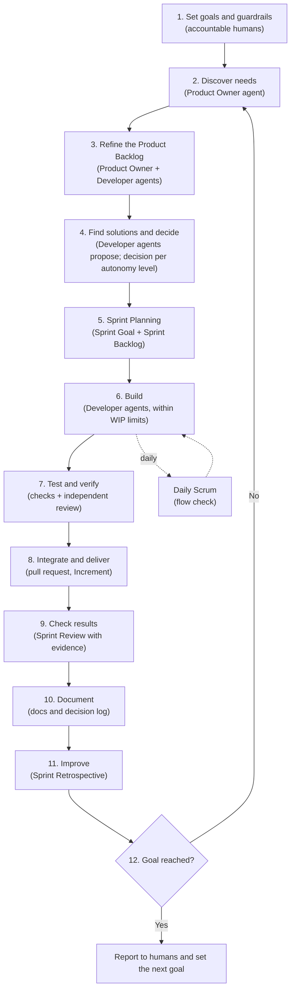

# The kenaido loop

> **Status:** the autonomy model below is part of the pack: levels 0 to 4 within the guardrails, with `GIT-4` (only humans push) unchanged at every level. The rest of the loop is a proposal and may change.

> **License of this file:** CC BY-SA 4.0 ([legal code](https://creativecommons.org/licenses/by-sa/4.0/legalcode)), not Apache-2.0 like most of kenaido. It describes, in kenaido's own words and with changes and additions, content from one or more of the guides listed in the `NOTICE` file that comes with kenaido, which are offered under the same license. The credits are in that file.

## Summary

kenaido runs one loop, from goal to goal, in which agents can take every role:

1. **The loop:** find needs, find solutions, decide, plan, build, test, check results, document, improve, and repeat until the goal is reached. It follows Scrum's Sprint and events, with Kanban flow and Evidence-Based Management measures built in.
2. **Autonomy levels:** each team chooses how much the agents do alone, from level 0 (agents only suggest) to level 4 (agents take every role and run the loop until the goal is reached).
3. **Always inspectable:** at every level, humans can see what was done, whether real value was added, whether things really improved, and whether quality meets the standard. A human always stays accountable (`PRIN-1`, `SCRUM-5`).

"Best possible solution" can't be proven in advance. The loop treats every solution as a hypothesis and keeps the ones that measurably move the goal forward (`VALUE-4`).

## The loop

| # | Step | What happens | Main rules |
|---|------|--------------|------------|
| 1 | **Set goals and guardrails** | Humans set the Strategic Goal, the Product Goal, the autonomy level, and the guardrails (budget, scope, time, locked rules) | `VALUE-2`, `PRIN-2` |
| 2 | **Discover needs** | Gather needs from users, stakeholders, data, and, for existing systems or migrations, from the current code. Write each need as a hypothesis with a measure | `VALUE-4`, `ANLY-1` |
| 3 | **Refine** | Break items down, add details, order by value, make dependencies visible | `SCRUM-2`, `SCALE-4` |
| 4 | **Find solutions and decide** | Propose options with a recommendation and record them. Decide, or escalate, according to the autonomy level | `PRIN-3`, `CODE-2` |
| 5 | **Sprint Planning** | Set a Sprint Goal tied to a customer outcome; size the plan with past throughput | `SCRUM-3`, `FLOW-6` |
| 6 | **Build** | Pull work only within WIP limits; contract first; clean, tested code | `FLOW-3`, `CODE-8`, `GIT-2` |
| 7 | **Test and verify** | Run every check; meet the Definition of Done; another agent or a human reviews. Nobody approves their own work | `TEST-1`, `GIT-6` |
| 8 | **Integrate and deliver** | Merge through a pull request; produce a usable Increment | `GIT-5` |
| 9 | **Check results** | Compare the Increment with the Sprint Goal, the value measures, and the flow metrics, with stakeholders | `VALUE-3`, `VALUE-5`, `FLOW-4` |
| 10 | **Document** | Update docs in the same change; record decisions | `DOC-2`, `PRIN-3` |
| 11 | **Improve** | Inspect flow, quality, the way of working, and how agents interacted; rank improvement bets, try the chosen ones, and keep only those that measurably help | `ANLY-6`, `FLOW-6`, `TRACE-5`, `IMPR-1` to `IMPR-8` |
| 12 | **Goal reached?** | If the Sprint Goal or an intermediate goal is reached, set the next one. If the Product Goal is reached, stop and report | `VALUE-2` |

## Autonomy levels

A team picks a level, and can use a different level for different kinds of decisions. Trust is earned step by step: a team moves up a level only when the evidence (quality, value, flow) supports it. This follows the agile leadership idea that teams take on more complex decisions as they prove themselves and earn trust.

| Level | Name | Agents do | Humans do |
|-------|------|-----------|-----------|
| **0** | Assist | Suggest options, draft text and code on request | All the work and every decision |
| **1** | Execute | Carry out assigned tasks | Decide everything; approve every change |
| **2** | Decide the how | Choose how to build within a Sprint | Decide what and why; approve merges |
| **3** | Run the Sprint | Run a whole Sprint toward a Sprint Goal humans approved | Approve the Sprint Goal; inspect at the Sprint Review; approve delivery of the Increment |
| **4** | Full autonomy (extreme) | Take every role and run the loop until the Product Goal is reached | Set goals and guardrails; get notified; can pause, stop, or reverse anything at any time |

Levels 3 and 4 rest on three rules: `PRIN-2` (humans decide, or delegate and keep the accountability), `GIT-6` (an approver who is not the author; a human below level 3), and `SCRUM-5` (a human holds the accountability, including for delegated decisions). `GIT-4` stays unchanged: only humans push, at every level. Before a team moves above level 1, the guardrails below must exist, and the thresholds must be set: **values each project sets in its own settings** (`DOC-8`), over the evidence above (quality, value, flow), before its accountable person raises the level. kenaido sets no default numbers.

**Pushing, at every level:** `GIT-4` keeps pushing with humans by default, levels 3 and 4 included. An accountable human may exceptionally delegate pushing to agents for a stated scope and period, recorded as a decision and revocable at any time, never covering `main`, tags, or releases. So a level 3 or 4 run either pauses for a human to push, or runs inside such a delegation: agents never take that step on their own initiative.

## Guardrails at every level

These always apply, including at level 4:

- **Locked rules:** tests, security scans, and secret scans can't be switched off (`CODE-10`, `TEST-1`).
- **Limits:** a budget for AI usage, a time limit, and a fixed scope of repositories and environments.
- **Isolation:** each agent runs in its own sandbox with only the access its role needs.
- **Humans for one-way doors:** anything hard to undo always goes to a human, e.g. deleting data, releasing to production, spending money, license or legal choices, and security exceptions.
- **Independent review:** no agent approves its own work.
- **Stop button:** a human can pause or stop any agent or the whole loop at any time, and undo its changes.
- **Full audit trail:** every action and decision is recorded with its reason.

## What humans can always inspect

The app keeps an evidence pack for every Sprint, available at any time, even when no human was involved:

| Question | Evidence |
|----------|----------|
| **What was done?** | Outputs: items finished, changes merged, decisions made (and by which agent or person) |
| **Was real value added?** | Outcomes: movement in the value measures chosen for each value area, compared with the goals (`VALUE-3`, `VALUE-5`) |
| **Did things really improve?** | Trends in flow metrics and value measures across Sprints (`FLOW-4`) |
| **Does quality meet the standard?** | Definition of Done results, test and scan results, review records, open technical debt (`TEST-1`) |
| **What did it cost?** | AI usage and time spent (inputs) |
| **What happens next?** | Each agent's plan, visible in the agent inspector |
| **How did the agents work together?** | Interaction records: who asked whom, reviews and corrections, disagreements, how decisions formed, and the cost (`TRACE-1` to `TRACE-4`) |

## Roles in the loop

Each step is carried out by a role defined in [`agents/`](../departments/), which also shows which agent covers each life cycle activity. How many agents of each kind a team may have follows [`rules/team.md`](../rules/team.md): some numbers are fixed, others change with evidence. With several groups of agents on one product, the multi-team scaling roles and events apply (`SCALE-2`, `SCALE-3`).
